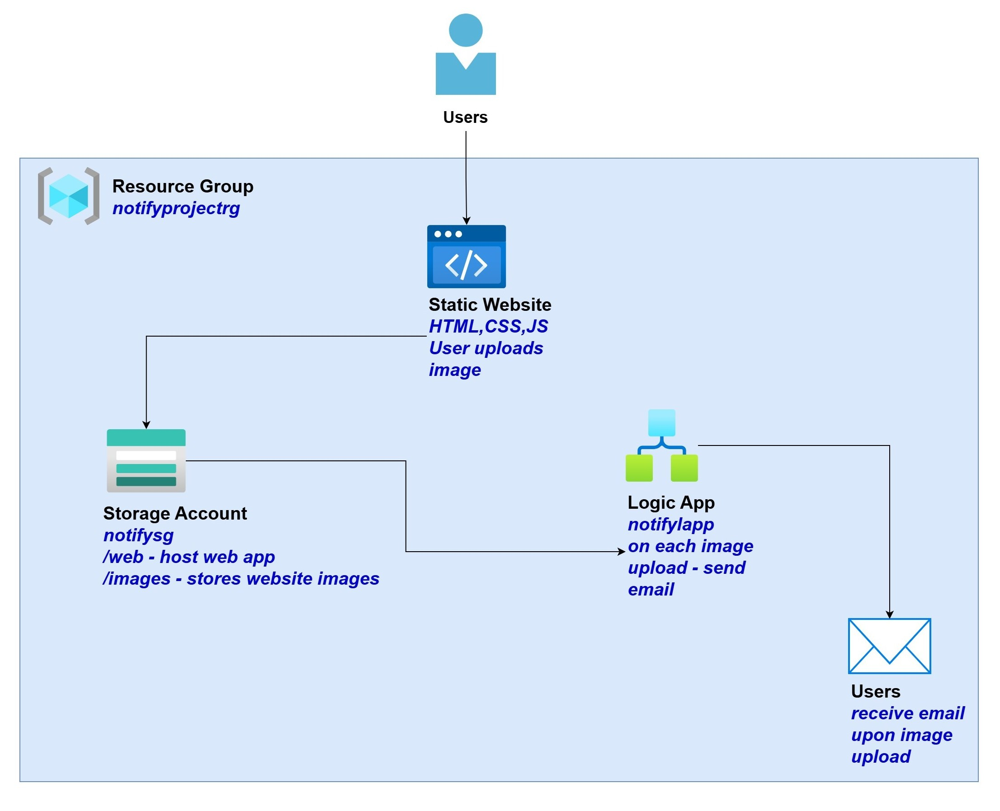
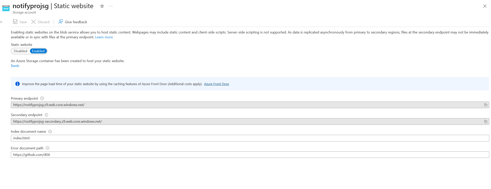
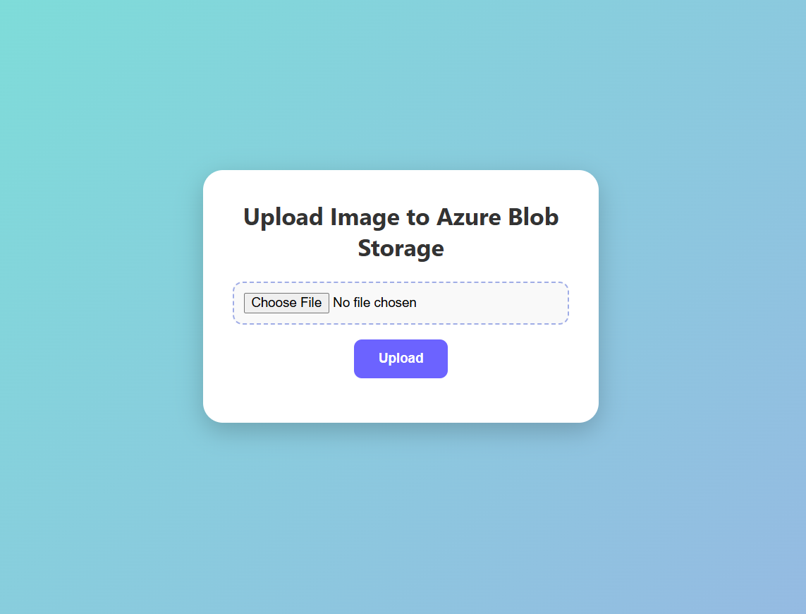
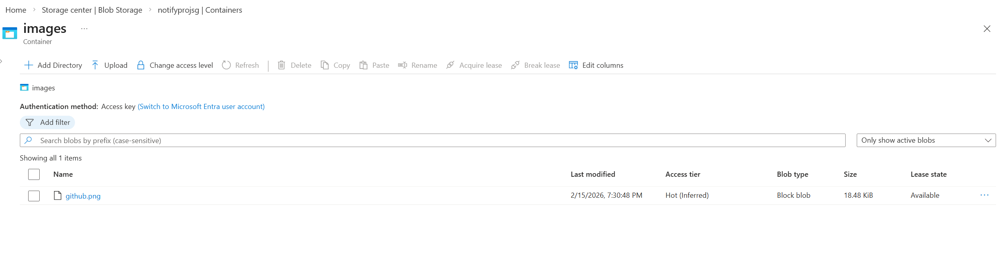
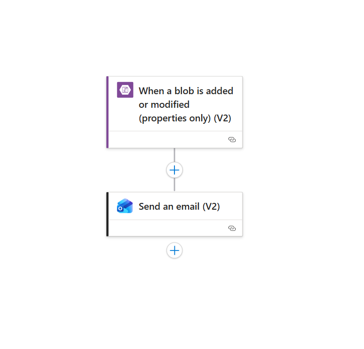

# 📬Notify
> A cloud-based image upload notification system built with Azure Blob Storage and Logic Apps.

### 📌Overview
This project demonstrates how two Azure resources — a Storage Account and a Logic App — are connected together to automate cloud workflows. Users upload images via a hosted static website that are stored in Azure Blob Storage, and an automated email notification is triggered via Logic Apps upon every upload.

### 🏗️Setup Architecture

### ⚙️How It Works
- **User uploads image** — Users upload an image through the  hosted static website.
- **Blob stores the image** — The uploaded image is stored in a dedicated images container.
- **Trigger Logic App**  —  Azure Logic App monitors the images container. When a new blob is uploaded, the Logic App workflow is automatically triggered.
-  **Send email notification** — The Azure Logic App sends an email to the user upon every image upload.

### 🪧Demonstration

#### Static Website Interface
 
*Users can visit the static website throught the primary endpoint url and upload the image*

---

#### Upload Success

*Uploaded image is successfully stored inside the images container*

---

#### Email Notification

*Users get the confirmation email whenever they upload the image*

---

#### Logic App Workflow

*The serverlesss workflow that monitors blob uploads and trigger email notifications*

